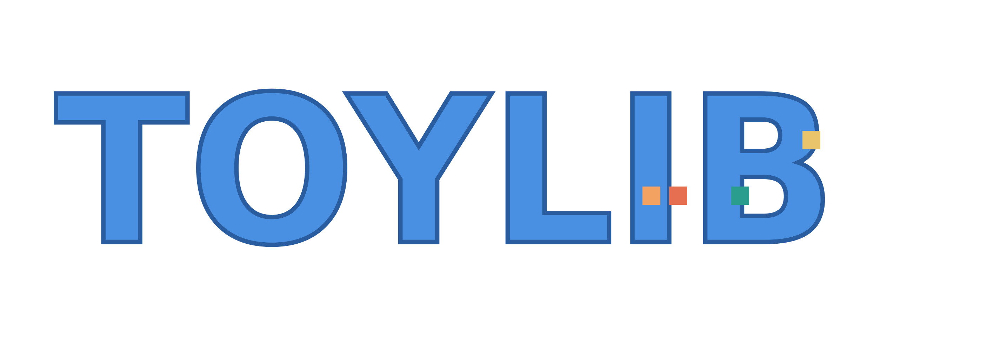

  

# ToyLib

> A friendly and modular Game Development Library (in development).

  
  
  

---

## ✨ Features (planned)
- Simple, flexible 3D and 2D rendering support
- Asset loading (models, textures, sounds)
- Input handling (keyboard, mouse, gamepad)
- Math utilities (vectors, matrices)
- Scene graph and camera utilities
- OpenGL and SDL2 based
- Lightweight, easy to integrate

---

## 🚀 Development Outlook
ToyLib is being developed alongside example projects and sample games.  
The library and sample games evolve together to ensure usability, stability, and real-world testing.

---

## 📚 License
This project is licensed under the [MIT License](./LICENSE).

---

## ⚠ Trademark Notice
The name **"ToyLib"** and its logo are unregistered trademarks of **Daisuke Nishimori**.  
They may not be used to represent other projects without explicit permission.

---

## 🤝 Contact
For questions or suggestions, please open an issue on the [GitHub repository](https://github.com/daisukn/ToyLib_Sample/issues).
